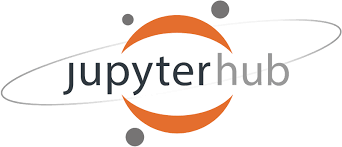

# mfcode_docs

**Max Fordham Engineering Development Best Practice**

This documentation aims to provide high-level, non-verbose notes outlining Max Fordham's engineering software development infrastructure.
Links to external sources and standards to describe the approach are preferred where possible.
The intended audience are those contributing-to and maintaining internal development tools, or external parties and collaborators interested in our approach.
Code snippets are encouraged.

**We stand on the shoulders of giants**. Our software is built on robust, high-quality opensource packages, and we are proud to share the work that we produce with the opensource community. 
When writing code there are always many solutions a problem;
we standardise the technologies we use for a given task to ensure a consistent approach across projects. See below for key technologies on which we rely.

:::{panels}
:container: +full-width text-center
:column: col-lg-4 px-2 py-2
:card:

**[packaging](packaging.md)**
^^^
conda build used to build conda packages to conda-forge feedstock recipe.

---

**[ide](developing.md)**
^^^
the ide (integrated development environment) is where we write code. All engineers have access to Jupyter Lab on the
server, and members of the core development Team also use VS Code.

---
**[deploying](deploying.md)**
^^^
the jupyterhub server is deployed to an internal server using ansible playbooks.

---
**[jupyterhub](deploying.md)**
^^^
a server hosted jupyterhub gives all Max Fordham users access to notebooks and apps. repo2docker creates docker images of apps and notebook environments.

---
**[apps](developing.md)**
^^^
standalone apps are made from notebooks using voila. they are deployed to the server using repo2docker. 

---
**[pyrevit](developing.md)**
^^^
Revit software is customised using pyRevit - a RapidApplicationDevelopment environment and python wrapper to the Revit API.

---
**[api](developing.md)**
^^^
FastAPI is used to create server hosted APIs. This templates interactions with databases and gives Revit or IES scripts access to 
other MF automation tools without complex user installs. 

---
**[databases](databases.md)**
^^^
postgresSQL is the preferred database tool. SQLalchemy uses to manage python interface.

---
**[expert help](https://quantstack.net/)
^^^
**[quantstack](https://quantstack.net/)**  
for help with the heavy lifting and deployment we call in the pros. 
Quantstack and one of the core Jupyter developers and are very active members of the opensource community. 
working with them means we can feel confident in our approach to software development, whilst concentrating on what we're best at: Engineering.

:::