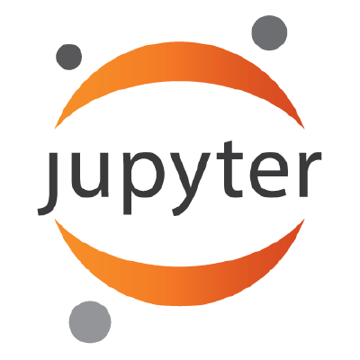
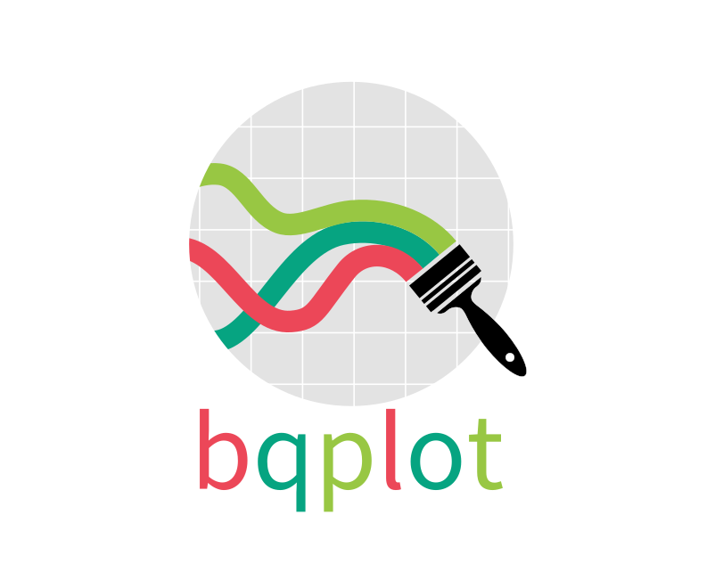
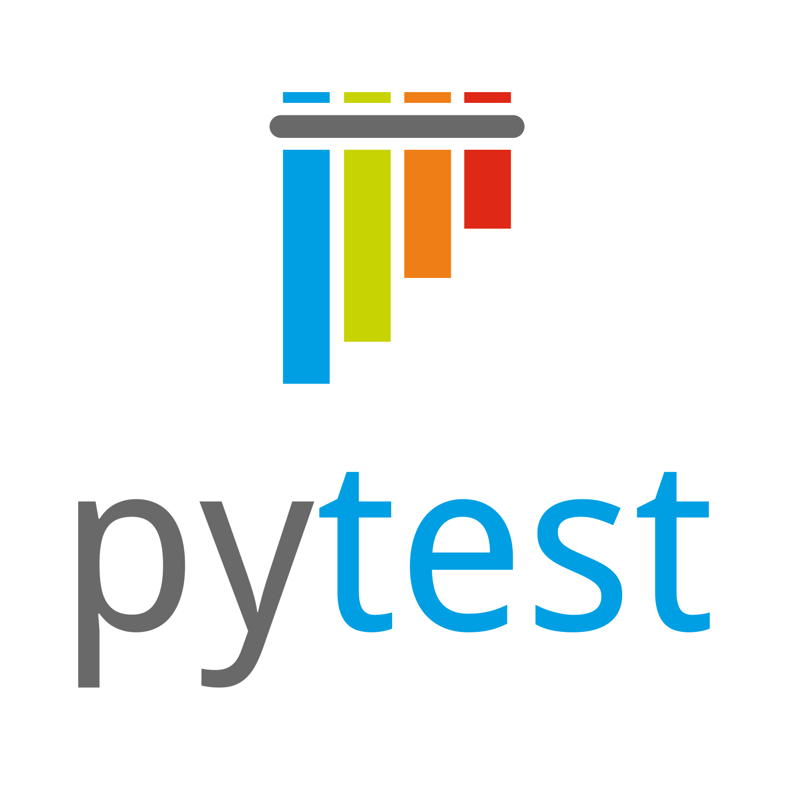

# Technologies

**We stand on the shoulders of giants**. Our software is built on robust, high-quality opensource packages, and we are proud to share the work that we produce with the opensource community.
When writing code there are always many solutions to a problem;
we standardise the technologies we use for a given task to ensure a consistent approach across projects. See below for key technologies on which we rely.

|    | technology                                                                                                                                            | description                                                                                                                                                                                                                                                                                                    |
|---:|:------------------------------------------------------------------------------------------------------------------------------------------------------|:---------------------------------------------------------------------------------------------------------------------------------------------------------------------------------------------------------------------------------------------------------------------------------------------------------------|
|  0 | [  conda-forge](https://conda-forge.org/)                                                                  | community maintained collection of opensource packages and template specifcation for new packages.                                                                                                                                                                                                             |
|  1 | [  conda](https://docs.conda.io/en/latest/conda-build.html)                                                            | tool for building conda packages, maintained by Anaconda.                                                                                                                                                                                                                                                      |
|  2 | [  mamba](https://github.com/mamba-org/mamba)                                                                          | Mamba is a fast, robust, and cross-platform package manager; it is a reimplementation of the conda package manager in C++.                                                                                                                                                                                     |
|  3 | [  ansible](https://docs.ansible.com/)                                                                             | Ansible playbooks are used to automate the setup, configuration and update of remote servers from a local machine. This is used to deploy our JupyterHub server.                                                                                                                                               |
|  4 | [  jupyterhub](https://jupyterhub.readthedocs.io/en/stable/)                                                 | JupyterHub is the best way to serve Jupyter notebook for multiple users. It can be used in a class of students, a corporate data science group or scientific research group.                                                                                                                                   |
|  5 | [  repo2docker](https://repo2docker.readthedocs.io/en/latest/index.html)                                   | repo2docker fetches a repository (from GitHub, GitLab, Zenodo, Figshare, Dataverse installations, a Git repository or a local directory) and builds a container image in which the code can be executed. The image build process is based on the configuration files found in the repository.                  |
|  6 | [  jupyter](https://jupyter.org/)                                                                                  | interactive coding and in-line report production                                                                                                                                                                                                                                                               |
|  7 | [  vscode](https://code.visualstudio.com/)                                                                           | state of the art IDE for software development                                                                                                                                                                                                                                                                  |
|  8 | [  pyrevit](https://www.notion.so/pyrevitlabs/pyRevit-bd907d6292ed4ce997c46e84b6ef67a0)                            | pyRevit (with lowercase py) is a Rapid Application Prototyping (RAD) environment for Autodesk Revit. It helps you quickly sketch out your automation and add-on ideas, in whichever language that you are most comfortable with, inside the Revit environment and using its APIs.                              |
|  9 | [  grasshopper+ladybug-tools](https://www.food4rhino.com/en/app/ladybug-tools) | visual coding and python scripting environment inside McNeel Rhino. good for early-stage concept design development and analysis.                                                                                                                                                                              |
| 10 | [  IES-vescripts](https://www.iesve.com/software/python-scripting)                                     | You can use the VE Python API to create your own customised scripts to: automate reports, data input, parametric simulations and many other tasks.                                                                                                                                                             |
| 11 | [  voila](https://github.com/voila-dashboards/voila)                                                                   | Voilà turns Jupyter notebooks into standalone web applications.                                                                                                                                                                                                                                                |
| 12 | [  plotly](https://plotly.com/python/getting-started/)                                                               | simple but powerful interactive web visualisation                                                                                                                                                                                                                                                              |
| 13 | [  altair](https://altair-viz.github.io/)                                                                            | declarative 2D plotting that wraps around vega d3 schemas                                                                                                                                                                                                                                                      |
| 14 | [  bqplot](https://github.com/bqplot/bqplot)                                                                         | plotting library build with jupyter widgets. allows for complex interactions with ipywidgets.                                                                                                                                                                                                                  |
| 15 | [  postgresql](https://www.postgresql.org/)                                                                  | PostgreSQL is a powerful, open source object-relational database system with over 30 years of active development that has earned it a strong reputation for reliability, feature robustness, and performance. It is used for production-grade tools.                                                           |
| 16 | [  sqlite](https://www.sqlite.org/index.html)                                                                        | SQLite is a C-language library that implements a small, fast, self-contained, high-reliability, full-featured, SQL database engine. It is used for some standalone apps and prototyping.                                                                                                                       |
| 17 | [  sqlalchemy](https://www.sqlalchemy.org/)                                                                  | SQLAlchemy is the Python SQL toolkit and Object Relational Mapper that gives application developers the full power and flexibility of SQL. Table definitions and relations are developed in SQL alchemy, as well as data-serialisation with pydantic.                                                          |
| 18 | [  pydantic](https://pydantic-docs.helpmanual.io/)                                                               | Define how data should be in pure, canonical python; validate it with pydantic.Used to create object definitions that feed: databases, calculation tools and documentation.                                                                                                                                    |
| 19 | [  FastAPI](https://fastapi.tiangolo.com/)                                                                         | FastAPI framework, high performance, easy to learn, fast to code, ready for production.It makes maintainence, upgrade and integration of production packages with software scripts simple asthe packages and environment is installed on the server.                                                           |
| 20 | [  pytest](https://docs.pytest.org/en/7.0.x/contents.html)                                                           | FastAPI framework, high performance, easy to learn, fast to code, ready for production.It makes maintainence, upgrade and integration of production packages with software scripts simple asthe packages and environment is installed on the server.                                                           |
| 21 | [  quantstack](https://quantstack.net/)                                                                      | for help with the heavy lifting and deployment we call in the pros.Quantstack are one of the core Jupyter developers and are active members of the opensource community.Working with them gives us confidence in our approach to software development,whilst concentrating on what we're best at: Engineering. |
| 22 | [  jupyterbook](https://jupyterbook.org/intro.html)                                                        | Jupyter Book is an open source project for building beautiful, publication-quality books and documents from computational material.                                                                                                                                                                            |
| 23 | [  sphinx](https://www.sphinx-doc.org/en/master/)                                                                    | Jupyter book utilises sphinx for many of its functions. Sphinx can also be used to auto-doc docstrings written in the Google Style Guide (MF standard).                                                                                                                                                        |